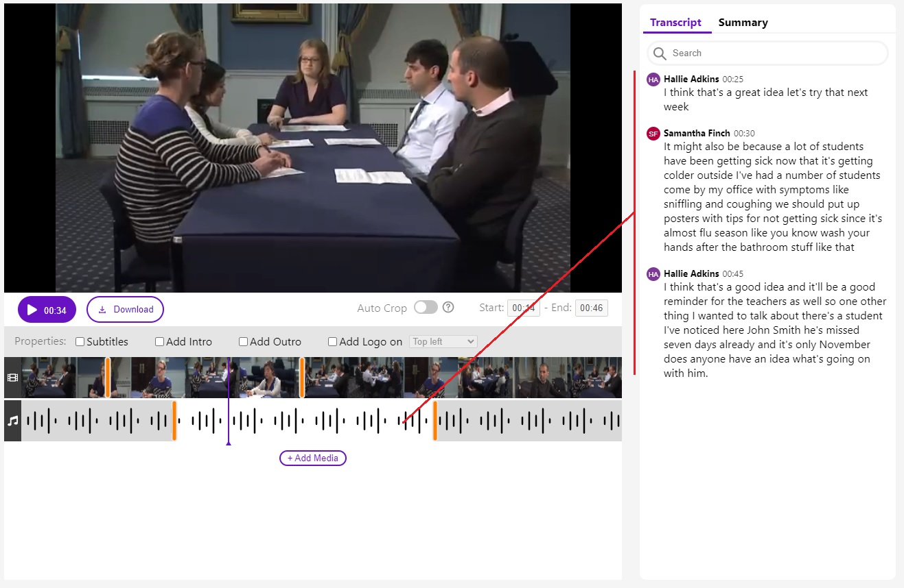
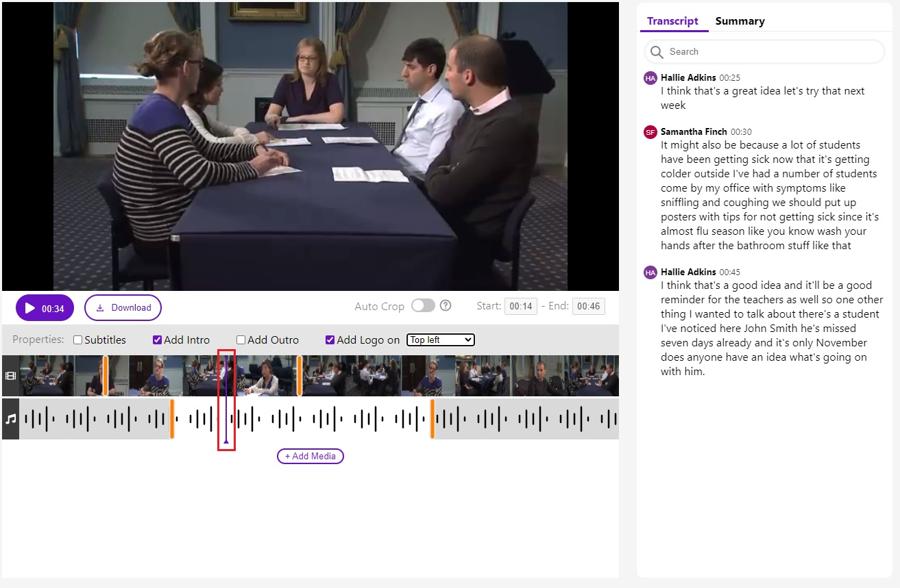
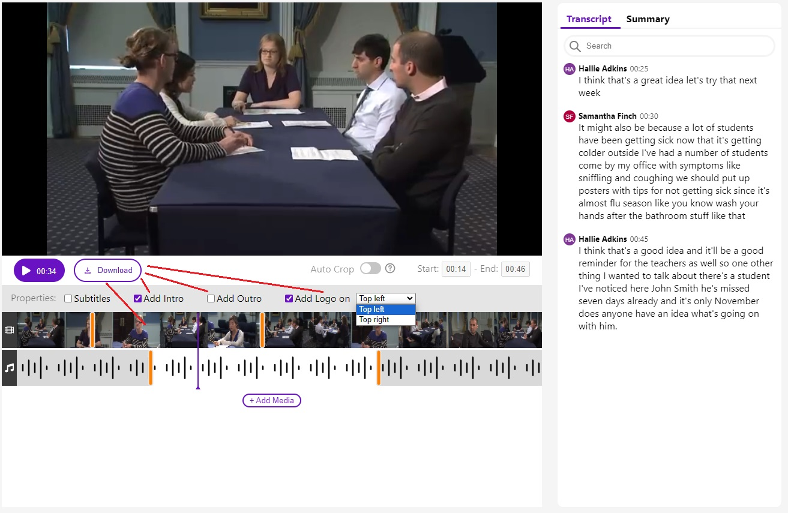
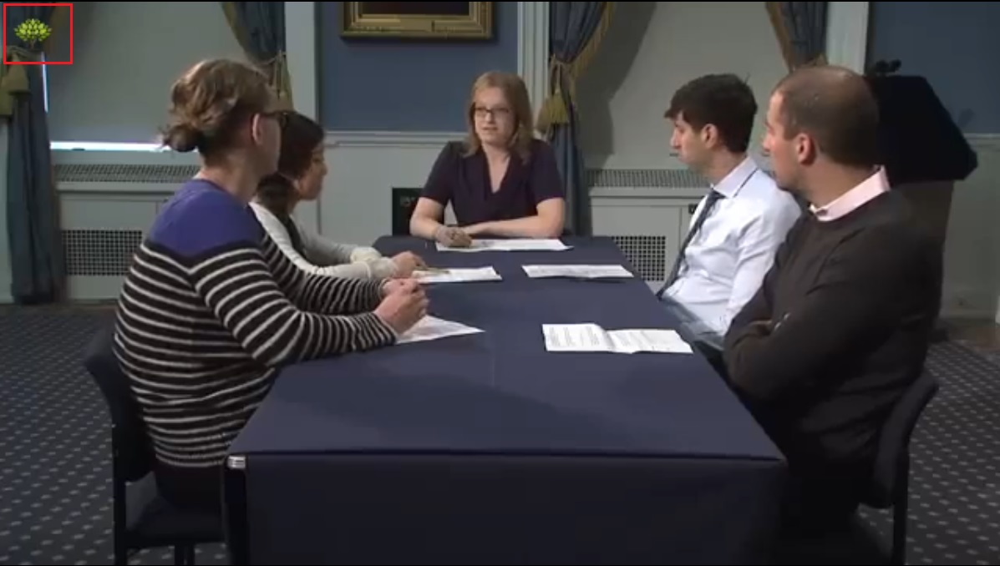

# Project Start Scripts

In the project directory, you can run:

### `npm install`
### `npm run start`

Runs the app in the development mode.\
Open [http://localhost:3000](http://localhost:3000) to view it in your browser.

# Description

Live demo available at [colossal-boot.surge.sh](https://colossal-boot.surge.sh/)

## Sound Control Slider

Changes made for this slider displays transcript for selected range

## Vide Control

Adjust current video timeline

## Download Button

After button click apply next changes and downloads new video:
* Crop video to selected Video slider range
* Optional
  * Add Intro
  * Add Outro
  * Add logo icon (excluded for intro and outro)

